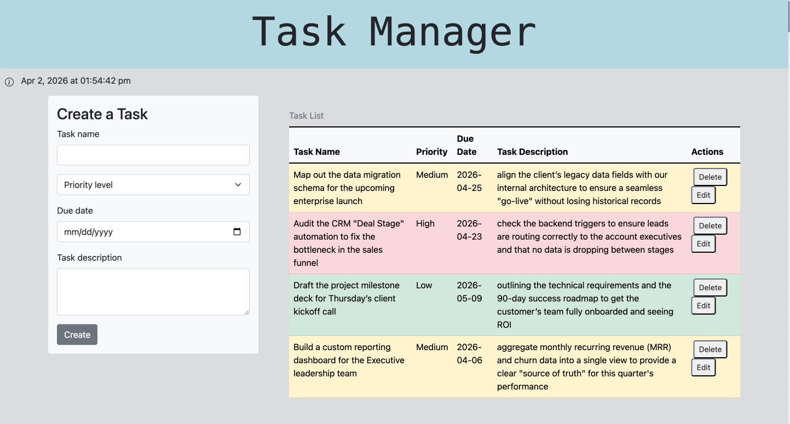
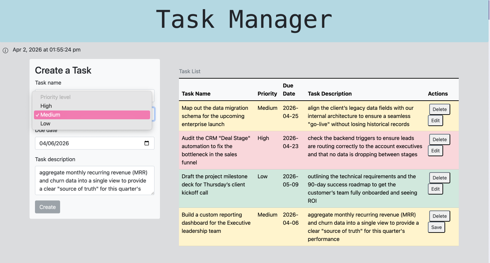

# Task Manager
### Streamlining Operational Workflows Through Structured, Persistent Task Management

[](https://task-mananger-7vkh.onrender.com/)
[](https://choosealicense.com/licenses/mit/)

---

## Table of Contents
- [Task Manager](#task-manager)
    - [Streamlining Operational Workflows Through Structured, Persistent Task Management](#streamlining-operational-workflows-through-structured-persistent-task-management)
  - [Table of Contents](#table-of-contents)
  - [Executive Summary](#executive-summary)
  - [Tech Stack \& Architecture](#tech-stack--architecture)
  - [Business Logic \& RevOps Impact](#business-logic--revops-impact)
  - [Screenshots \& Demo](#screenshots--demo)
  - [Installation \& Setup](#installation--setup)
  - [Ideal User Journey](#ideal-user-journey)
  - [Learning Points](#learning-points)
  - [Author Info](#author-info)
  - [License](#license)

---

## Executive Summary

In fast-moving customer success and revenue operations environments, task visibility directly impacts team performance, onboarding quality, and retention outcomes. Dropped follow-ups, miscommunicated priorities, and lost context are not just productivity problems — they are churn risks.

**Task Manager** is a full-stack web application that solves this by giving users a structured, persistent system to capture, prioritize, and track tasks with full CRUD (Create, Read, Update, Delete) functionality. Each task records a name, priority level (High / Medium / Low), due date, and description — mirroring the fields that matter in real CSM and RevOps workflows.

Built on a Node.js/Express backend with JSON-based data persistence, the application demonstrates reliable data handling, client-server communication, and user-facing feedback — the same foundations that underpin SaaS platforms used by CS and RevOps teams daily.

---

## Tech Stack & Architecture

| Technology | Role | Why It Was Chosen |
|---|---|---|
| HTML / CSS | Structure & styling | Lightweight, universally compatible client layer |
| JavaScript | Client-side interactivity | Enables dynamic UI updates without page reloads |
| jQuery | DOM manipulation & AJAX | Simplifies event handling and async API calls |
| jQuery UI Datepicker | Date input | Reduces user input errors on due dates |
| Bootstrap | Responsive layout & priority coloring | Rapid UI development; priority-based row styling improves task scanning |
| Node.js | Server runtime | Non-blocking I/O for handling concurrent requests |
| Express | RESTful API framework | Structured routing for clean, maintainable backend logic |
| UUID | Unique task identification | Prevents ID collisions across create/update/delete operations |
| File System (fs) | Data persistence | JSON-based storage layer simulates a lightweight database |

---

## Business Logic & RevOps Impact

This project was designed around the same data integrity and workflow concerns that arise in production SaaS environments.

**Data Integrity Across the Full Lifecycle**

Every task is assigned a UUID on creation, ensuring each record is uniquely addressable throughout its lifecycle. Updates and deletes target records by ID — not by position or name — eliminating a common class of data corruption errors that surface in high-volume task environments.

**Reliable State Management**

Backend operations (read, write, update, delete) are validated before any changes are committed to storage. If a task cannot be located during an update or delete, the server returns a structured 404 error rather than silently failing — preserving data integrity and giving the client actionable feedback. This mirrors the error-handling discipline expected in production support workflows.

**Scalable CRUD Architecture**

Routes are organized by resource and method (GET, POST, PUT, DELETE on `/tasks/`), following RESTful conventions. This separation makes it straightforward to extend the data model — adding assignees, completion status, or integrations — without restructuring existing logic.

**Priority-Based Visibility**

Tasks are color-coded by priority using Bootstrap classes, so High-priority items surface immediately in the UI. This design mirrors the triage logic used in support queues and CS health dashboards, where visual hierarchy drives faster response times.

**Relevance to CSM / RevOps Workflows**

| Application Behavior | Real-World Parallel |
|---|---|
| Validating input before write | Preventing bad data from entering a CRM |
| ID-based record targeting | Deduplication in revenue reporting |
| Structured error responses | Escalation paths in support tooling |
| Persistent storage across sessions | Customer record continuity in CS platforms |
| Priority-based UI coloring | Health score triage in CS dashboards |

---

## Screenshots & Demo

📸 **Task Dashboard — Full Task List View**


✏️ **Edit Task — Pre-filled Form with Existing Data**



<div>
    <a href="https://www.loom.com/share/57ebf8640c3341dfa3828443c7b424e9">
      <p>🎥 Walkthrough Demo</p>
    </a>
    <a href="https://www.loom.com/share/57ebf8640c3341dfa3828443c7b424e9">
      
    </a>
  </div>


---

## Installation & Setup

These steps mirror the onboarding documentation used to guide clients through technical configurations.

**Prerequisites:** Node.js (v14 or higher) and npm installed on your machine.

**1. Clone the repository**
```bash
git clone https://github.com/megellman/task-manager.git
cd task-manager
```

**2. Install dependencies**
```bash
npm install
```

**3. Start the server**
```bash
node server.js
```

**4. Open the application**

Navigate to `http://localhost:3001` in your browser.

> **Note:** The `db/tasks.json` file is created automatically on first use. No database configuration is required.

---

## Ideal User Journey

1. **Capture** — A user opens the application and fills out the task form: task name, priority level, due date, and a short description. They submit, and the task appears immediately in the table.

2. **Triage** — The task list uses color-coded rows (High = red, Medium = yellow, Low = green) so the user can instantly identify what needs attention first — no sorting required.

3. **Update** — When priorities shift, the user clicks Edit on any task. The form pre-populates with existing data, reducing re-entry friction and minimizing errors.

4. **Close the Loop** — Once a task is complete, the user removes it with a single click. The list reflects the change immediately, keeping the workspace clean and current.

5. **Return** — Because data persists on the backend, the user's task list is exactly where they left it the next time they open the application.

---

## Learning Points

- Designed and implemented a full RESTful CRUD backend using Express and file-based JSON storage
- Debugged synchronization issues between frontend state and backend data to ensure UI accuracy after every operation
- Applied input validation and structured error handling to protect data integrity across all routes
- Used UUID-based record identification to support reliable update and delete operations at scale
- Organized backend routes for maintainability and to simplify root-cause analysis during troubleshooting

---

## Author Info

**Megan Ellman**

[](https://megellman.github.io/react-portfolio/)
[](https://www.linkedin.com/in/megan-ellman/)
[](https://github.com/megellman)

---

## License

[MIT License](https://choosealicense.com/licenses/mit/)